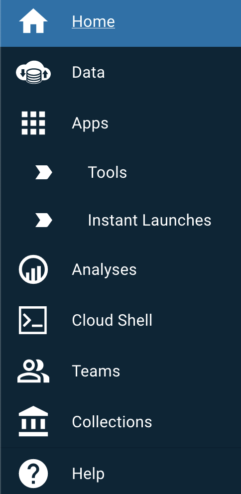

# Tour of the Discovery Environment

??? tip "Learning Objectives"
    
    - Sign up and log in to the Discovery Environment
    - Learn about the major menu items
    - Create folder for data and analysis

**Description:**

This module introduces the web interface of the Discovery Environment.
Follow the self-guided tour to navigate through each of the major menu
items and learn what you can do in each menu. Lastly, you will create a
folder in your home directory for your data and analyses which you can
use for subsequent modules.

> 

> <iframe width="560" height="315" src="https://www.youtube.com/embed/jZihE2QuBrw" title="YouTube video player" frameborder="0" allow="accelerometer; autoplay; clipboard-write; encrypted-media; gyroscope; picture-in-picture" allowfullscreen></iframe>
> 

## Self-guided Discovery Environment Tour

1.  Sign up and log into the CyVerse [{width="20"}](https://de.cyverse.org/data){target=_blank} [Discovery Environment](https://de.cyverse.org/de){target=_blank}.

2.  Familiarize with platform by hovering and clicking on the different
    options:
    a. Use the search bar where you can search for anything in the Data, Apps, and Analyses panels. You can select to limit the search using the dropdown menu of these panels on the search bar.
    b. Use the question button to chat with CyVerse support.
    c. Use the bag feature to organize items you want to download (e.g. like an online shopping cart).
    d. Use notifications to see the history and status of analyses and data sharing, and other transactions.

3.  On the left-hand sidebar, click on the following to see what is available:

[home]: assets/de/menu_items/homeIcon.svg
[data]: assets/de/menu_items/dataIcon.svg
[apps]: assets/de/menu_items/appsIcon.svg
[analysis]: assets/de/menu_items/analysisIcon.svg
[shell]: assets/de/menu_items/webshellIcon.svg
[team]: assets/de/menu_items/teamsIcon.svg
[bank]: assets/de/menu_items/bank.svg
[help]: assets/de/menu_items/helpIcon.svg

    ![][home]{width=20} **Home** - Dashboard

    ![][data]{width=25} **Data** - Interface to the Data Store, including your personal and shared data

    ![][apps]{width=20} **Apps** - Applications (including VICE interactive applications)

    ![][analysis]{width=20} **Analyses** - Status and history of analysis jobs

    ![][shell]{width=20} **Cloud shell** - Quicklaunch of a Linux shell

    ![][team]{width=20} **Teams** - Organize collaborators and sharing

    ![][bank]{width=20} **Collections** - Public collections of applications and data

    ![][help]{width=20} **Help** - Help and support

    [{width="150"}](https://de.cyverse.org/data){target=_blank} 
    
??? Tip
    
    You can expand the navigation side bar for a detailed description of views in the Discovery Environment by clicking on the :material-bars:

4.  Go back to the Data menu and familiarize with the options:

    a.  Your folder in Data ![][data]{width=25}

    b.  Click on the "Shared with me" folder

    c.  Then select "Community Data" folder

    d.  "Trash"

??? success "Try it!"

    In your home folder create a folder named `tutorial_folder`.

    Inside that folder create two additional folders: `raw_data/` and `results/`

------------------------------------------------------------------------

**Output/Results**

| Output | Description |
|--------|-------------|
| `/tutorial folder/` (folder) `tutorial_folder/raw_data` (folder) `tutorial_folder/results` (folder) | - We will cover in detail how to create and share folders in the next steps of the course. - The will contain example data from future steps in the tutorial |

------------------------------------------------------------------------

### Self Assessment Questions

??? Question "Which of the following is NOT part of the Discovery Environment Menu?"
    
    **A.** Data

    **B.** Apps

    **C.** Teams

    **D.** Videos

    ??? Answer
        
        **Correct answer is D.**

        Although videos are not a DE menu, videos and webinars are available in the 'Home' view dashboard.

??? Question "Select all that applies: Which of these can you do on the Discovery Environment?"
    
    **A.**  Create public and private teams

    **B.**  Search for data and apps

    **C.**  Send message to other CyVerse users

    **D.**  Launch environments like Jupyter and Rstudio

    ??? Answer
        
        **Correct answer is A, B, D.**

??? Tip
 
    **See other versions of this documentation (CyVerse UK and CyVerse Austria)**
    In the lower-left hand side of the screen, change the version of this
    documentation from cyverse-us to one of the other documentation sets
    developed for this online guide (*cyverse-uk* or *cyverse-at*) to see
    specifics for those installations.

-----------------------------------------------------------------------

**Fix or improve this documentation**

  - Search for an answer:
     [CyVerse Learning Center](https://learning.cyverse.org)
  - Ask us for help:
    click the Intercom icon { width="25" } on the lower right-hand side of the page
  - Report an issue or submit a change:
    [Github Repo Link](https://github.com/cyverse-learning-materials/)
  - Send feedback: <Tutorials@CyVerse.org>
  
------------------------------------------------------------------------

[Learning Center Home](http://learning.cyverse.org/)